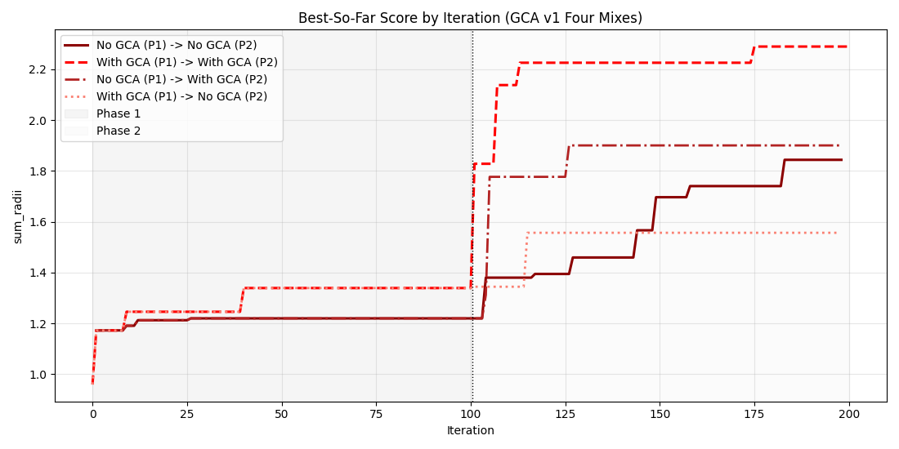
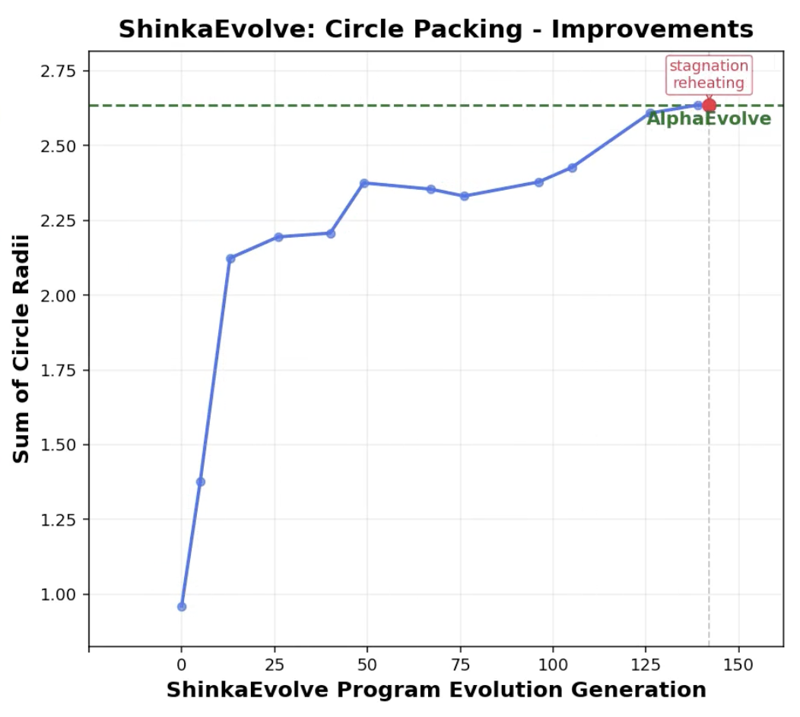

# Global Collective Archive (GCA)

**GCA converts implicit, ephemeral collective knowledge in evolutionary LLM systems into explicit, persistent, strategy-level memory.** In v0, GCA is a pure observer. In v1, GCA completes the feedback loop by injecting top strategies back into the LLM prompt every iteration.

---

## 1. Motivation & Context

Evolutionary LLM systems like OpenEvolve, FunSearch, and AlphaEvolve accumulate rich information over time: code patterns that work, approaches that fail, and contextual dynamics that shift across the search landscape. Yet most of this information remains **implicit**, **non-reusable across runs**, and **not attributable at the strategy level**.

**ShinkaEvolve** represents an important step forward. It uses meta-analysis to periodically summarize past evolutionary runs and injects high-level guidance back into the evolution process. This collective memory enables the system to learn from prior exploration and adapt its search strategy over time.

However, ShinkaEvolve's collective memory has key limitations:

* **Coarse-grained**: Aggregated after fixed intervals, not linked to individual solutions
* **Ephemeral**: Exists as textual summaries in prompts, not as persistent entities
* **Not first-class**: No identity, no deduplication, no independent queryability
* **Opaque**: Difficult to inspect, attribute, or reason about strategy effectiveness

These limitations motivate a more explicit, persistent notion of collective memory.

---

## 2. Core Idea: Global Collective Archive (GCA)

GCA introduces **strategy-level memory as a first-class abstraction** in evolutionary LLM systems.

Unlike ShinkaEvolve's prompt-based meta-analysis, GCA treats strategies as:

* **Extracted** from evolved solutions and their evaluation outcomes
* **Persistent** across runs, stored in a queryable archive
* **Independently addressable**, with identity, deduplication, and empirical grounding

### Conceptual Shift

| Approach | Memory Model | Granularity | Persistence | Attribution |
|----------|-------------|-------------|-------------|-------------|
| **ShinkaEvolve** | Meta-analysis as prompt decoration | Aggregated summaries | Ephemeral (per-run) | Implicit |
| **GCA** | Persistent, addressable knowledge | Strategy-level entities | Durable (cross-run) | Explicit |

GCA moves from *"summarize what happened"* to *"store what was learned"*.

---

## 3. Design Principles

These principles guide GCA's architecture and differentiate it from intervention-heavy approaches:

1. **Minimal intervention**: GCA does not modify OpenEvolve's evolution logic
2. **Observer-only**: Analysis happens post-evaluation, never in the critical path
3. **Append-only memory**: Strategies are accumulated, not overwritten
4. **First-class strategy objects**: Strategies have identity, deduplication, and empirical records
5. **Asynchronous, non-blocking**: Strategy extraction runs in background threads
6. **Separation of understanding vs control**: GCA observes and records; future work may inform selection

These principles avoid the brittleness and opacity of summary-only approaches while enabling systematic study of collective memory.

---

## 4. High-Level Architecture

```
┌─────────────────────────────────────────────────────┐
│          OpenEvolve                                  │
│  ┌──────────┐  ┌──────────┐  ┌──────────┐           │
│  │ Database │  │ Iterator │  │Evaluator │           │
│  └──────────┘  └──────────┘  └──────────┘           │
└───────┬────────────────────────────┬───────────────-┘
        │ evaluation events          ▲ top strategies
        ▼                            │ (v1 feedback)
 ┌───────────────────┐               │
 │ Strategy Extractor│               │
 └────────┬──────────┘               │
          │ strategies               │
          ▼                          │
 ┌───────────────────┐    ┌─────────┴─────────┐
 │ Global Collective │───▶│ Strategy Feedback │
 │     Archive       │    │  (prompt injection)│
 └───────────────────┘    └───────────────────┘
```

**Key architectural properties**:

* GCA sits **outside the evolution loop**
* **v0 (observer path)**: Observes evaluation events, extracts strategies, and records them
* **v1 (feedback path)**: Before each iteration, queries top strategies by fitness and injects them into the LLM prompt as a "Collective Strategy Insights" section
* Evolution logic is unchanged; GCA adds a parallel understanding layer and optional strategy guidance

---

## 5. Conceptual Data Model

GCA's data model emphasizes rigor and empirical grounding:

### Entities

1. **Program Evaluation Event**
   * Source code (full text)
   * Evaluation outcome (scores, artifacts, metadata)
   * Temporal context (iteration, timestamp, island)
   * Provenance (parent, mutation strategy)

2. **Strategy** (first-class, deduplicated)
   * Unique semantic identity (content-addressed)
   * Human-readable description
   * Tags or categories (optional)
   * Extracted from code and outcomes, not specified a priori

3. **Strategy Occurrence** (empirical grounding)
   * Links a strategy to a specific program evaluation
   * Stores raw outcome data (not premature scores)
   * Enables post-hoc analysis and re-evaluation

### Why Separate Strategies and Occurrences?

* **Strategies** represent general patterns (e.g., "dynamic programming memoization")
* **Occurrences** ground them in empirical reality (e.g., "used in program X, achieved score Y")
* This separation enables:
  * Deduplication across solutions
  * Temporal analysis of strategy emergence
  * Counterfactual and regime-conditioned queries

---

## 6. Strategy Extraction Semantics (MVP)

### What Are Strategies?

In GCA v0, strategies are **observations extracted from code and evaluation outcomes**, not instructions or prompts.

Strategies represent:
* Algorithmic patterns (e.g., "pruning search space via bounds")
* Data structure choices (e.g., "prefix sum array for range queries")
* Optimization techniques (e.g., "early exit on threshold satisfaction")
* Domain-specific heuristics (e.g., "prioritize high-density regions")

### How Are They Extracted?

* **LLM-based semantic analysis** of source code and evaluation artifacts
* **Trigger-based**: Extraction is selective (e.g., high-performing programs, novelty events)
* **Zero to N strategies per solution**: Not every program yields a strategy
* **Post-evaluation**: Analysis never blocks the evolution process

### What Strategies Are Not

* Not manually specified templates
* Not mutation operators or prompt fragments
* Not control signals for the evolution process (in v0)

**Key principle**: In GCA v0, strategies are *observations*, not *instructions*. GCA v1 crosses this boundary — strategies become *guidance* fed back to the LLM (see Section 7).

---

## 7. GCA v1 — Strategy Feedback Loop

GCA v0 is observer-only: it extracts strategies and stores them, but never feeds them back to the LLM. **GCA v1 completes the feedback loop** by injecting top-performing strategies into every LLM prompt as meta-reasoning guidance.

### How It Works

Before each iteration, the main process:

1. Queries `ArchiveQuery.top_strategies_by_fitness(top_k)` — strategies ranked by best associated program fitness
2. Serializes them into the database snapshot as `snapshot["gca_strategies"]`
3. The worker process picks up the snapshot, renders the strategies into a **"Collective Strategy Insights"** section in the prompt

### Data Flow

```
Main Process                          Worker Process
─────────────                         ──────────────
gca_stack.archive.query
  .top_strategies_by_fitness(3)
         │
         ▼
snapshot["gca_strategies"] = [
  {"description": "...",
   "best_fitness": 0.85,
   "count": 5}, ...
]
         │
         ▼ (pickle via ProcessPool)
                                      db_snapshot["gca_strategies"]
                                               │
                                               ▼
                                      build_prompt(gca_strategies=...)
                                               │
                                               ▼
                                      "## Collective Strategy Insights
                                       Here are strategies that previously
                                       improved fitness..."
```

### Prompt Injection Format

Each strategy is rendered as a bullet point within the prompt's evolution history section:

```
## Collective Strategy Insights

Here are strategies that previously improved fitness. Reflect on whether
adapting or combining them could improve the current program.

- **uses scipy.optimize SLSQP for constrained optimization** (best fitness: 2.6343, seen in 12 programs)
- **hexagonal close-packing as initial seed layout** (best fitness: 2.4210, seen in 8 programs)
- **iterative greedy radius expansion with overlap correction** (best fitness: 2.3770, seen in 5 programs)
```

This section appears at the top of the evolution history template (`evolution_history.txt`), before "Previous Attempts" and "Top Performing Programs". When feedback is disabled or no strategies exist yet, the section is omitted entirely.

### Configuration

```yaml
gca:
  enabled: true
  store_path: "./gca_store"
  feedback:
    enabled: true   # false = v0 observer-only behavior
    top_k: 3
  extractor:
    type: "llm_solution_analysis"
    max_strategies: 3
  policy:
    type: "mvp"
```

### Backward Compatibility

* `feedback` defaults to `enabled: false` — runs without a `feedback:` section work identically to v0
* All v0 design choices (extraction, storage, observer pipeline) are preserved unchanged
* GCA v1 only adds a **read-only feedback path** from the archive back to the prompt

---

## 8. What GCA Enables Today

With GCA v0 (observer), you can:

1. **Enumerate recurring strategies across runs**
   * Query: "Which strategies appear most frequently?"
   * Query: "When did strategy X first emerge?"

2. **Link strategies to concrete solutions**
   * Query: "Show me all programs that used strategy Y"
   * Query: "What were the evaluation outcomes for strategy Z?"

3. **Observe temporal dynamics**
   * Track strategy emergence over iterations
   * Identify early vs late-stage strategies
   * Detect strategy convergence or divergence

4. **Ground strategy effectiveness empirically**
   * Raw data stored for post-hoc analysis
   * No premature aggregation or scoring

With GCA v1 (feedback), you additionally get:

5. **Strategy-guided evolution**
   * Top strategies (ranked by best associated program fitness) are injected into every LLM prompt
   * The LLM receives explicit meta-reasoning guidance about what has worked well so far
   * Strategies accumulate over iterations, providing increasingly informed guidance

These capabilities provide a foundation for systematic study — and active use — of collective memory in evolutionary LLM systems.

---

## 9. What GCA Unlocks Next (Forward-Looking)

GCA's explicit memory enables natural extensions. GCA v1 realized one of these (marked below); the rest remain future directions:

* **Strategy effectiveness estimation**: Statistical models of strategy-outcome associations
* **Strategy decay and forgetting**: Time-based or relevance-based pruning
* **Feature-conditioned statistics**: "Which strategies work in specific regimes?"
* **Parent-delta triggers**: Extract strategies from programs that significantly outperform parents
* ~~**Closed-loop integration**: Let GCA insights influence evolution policy in real time~~ — **Partially realized in v1** via fitness-ranked prompt injection
* **Strategy selection or weighting**: More sophisticated selection beyond top-k by fitness
* **Novelty-based extraction**: Focus on programs that diverge from known strategies
* **Cross-task transfer**: Reuse strategies from prior problem domains
* **Strategy composition**: Combine or synthesize strategies for new contexts
* **Meta-learning**: Optimize strategy extraction and application policies

**Key framing**: v0 is observer-first; v1 adds a minimal feedback path; the remaining extensions are future directions built on top of persistent strategy memory.

---

## 10. Experimental Setup

### GCA v1 Four-Mix Ablation

To evaluate GCA v1's strategy feedback, we run a full 2×2 ablation across phases:

| Run | Phase 1 | Phase 2 |
|-----|---------|---------|
| `mix_no_p1_to_no_p2` | No GCA | No GCA |
| `mix_no_p1_to_with_p2` | No GCA | GCA v1 feedback |
| `mix_with_p1_to_no_p2` | GCA v1 feedback | No GCA |
| `mix_with_p1_to_with_p2` | GCA v1 feedback | GCA v1 feedback |

### Experimental Controls
* Same task and evaluation function (circle packing, n=26)
* Identical evolution configuration (population size, mutation rates, etc.)
* Same model family across compared runs: Gemini 2.5 Flash Lite
* Same two-phase schedule: Phase 1 (exploration-oriented) followed by Phase 2 (post-plateau), each run for 100 iterations
* Phase 2 runs resume from the corresponding Phase 1 checkpoint
* GCA extraction operates asynchronously; feedback is injected synchronously before each iteration
* Metrics: solution quality over time (`sum_radii`), strategy diversity
* Full per-phase configuration details are documented in the YAML files under `examples/circle_packing/` (e.g., `config_phase_1_gca_v1.yaml`, `config_phase_2_no_gca_v1.yaml`, etc.)

---

## 11. Experimental Results

### GCA v1 Four-Mix Comparison Plot



### ShinkaEvolve Reference Plot



### Observations and Interpretation

The v1 four-mix ablation produced a clear pattern across phase schedules:

* **GCA feedback in both phases** (`with_p1_to_with_p2`) yielded the strongest final score among tested settings.
* **No GCA in either phase** (`no_p1_to_no_p2`) yielded the lowest final score.
* The two mixed conditions (`no_p1_to_with_p2` and `with_p1_to_no_p2`) fell between the two extremes.

This pattern is consistent with the hypothesis that strategy feedback provides cumulative benefit: the longer strategies are fed back into the LLM prompt, the more the evolution benefits from collective memory.

#### Model-Capacity Caveat

These runs used Gemini 2.5 Flash Lite. As a lightweight model, it may not be ideal for high-fidelity strategy extraction in GCA-enabled settings, especially if extraction quality depends on deeper reasoning capacity.

#### Comparison to ShinkaEvolve Dynamics

Both our setup and the ShinkaEvolve reference approach a similar high-end `sum_radii` regime near the best-known level, but with different temporal dynamics. A plausible explanation is systems-level difference: ShinkaEvolve includes additional mechanisms beyond vanilla OpenEvolve (e.g., periodic meta-analysis, explicit lineage interactions, population-level competition, novelty-based rejection/sampling), whereas our setup isolates the effect of adding GCA feedback to a largely vanilla OpenEvolve loop.

#### Next Validation Steps

These findings are promising but not definitive. The next step is controlled replication across:

* multiple random seeds
* different model families and capacities
* longer iteration budgets

This is necessary to separate genuine GCA v1 feedback effects from variance and interaction effects.

---

## 12. Appendix: File Guide

This repository's `gca/` package is intentionally modular. Each file has a focused role:

* `gca/__init__.py`: Public exports and `GCAStack` factory that wires all components.
* `gca/__main__.py`: Allows `python -m gca` CLI entry.
* `gca/config.py`: Typed config schema and parsing (`GCAConfig.from_dict`).
* `gca/schemas.py`: Core immutable dataclasses and helper functions (hashing, canonicalization).
* `gca/persistence.py`: Append-only storage layer (JSONL logs, metadata, content-addressed code).
* `gca/extractor.py`: Strategy extraction interfaces and implementations (LLM + heuristic).
* `gca/policy.py`: Extraction trigger policies (`mvp`, `always`, `never`).
* `gca/registry.py`: Strategy deduplication and catalog registration.
* `gca/archive.py`: Archive write path and read/query interface.
* `gca/query.py`: Convenience `load_query()` helpers.
* `gca/observer.py`: Post-evaluation observer + async extraction worker.
* `gca/openevolve_integration.py`: Adapter layer between OpenEvolve runtime objects and GCA events.
* `gca/cli.py`: Human-facing inspection CLI for archive contents.

Design references:

* `gca/gca-v0-design.md` captures the original implementation plan, invariants, and layering decisions that guided this package.
* `gca/gca-v1-design.md` captures the strategy feedback loop design added in v1.
