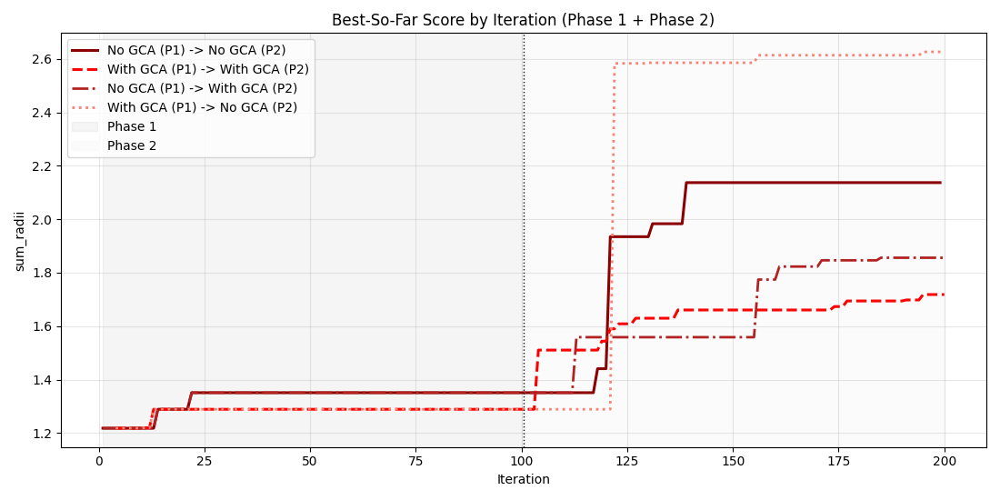

# Global Collective Archive (GCA)

**GCA converts implicit, ephemeral collective knowledge in evolutionary LLM systems into explicit, persistent, strategy-level memory—without changing the evolution process itself.**

---

## 1. Motivation & Context

Evolutionary LLM systems like OpenEvolve, FunSearch, and AlphaEvolve accumulate rich information over time: code patterns that work, approaches that fail, and contextual dynamics that shift across the search landscape. Yet most of this information remains **implicit**, **non-reusable across runs**, and **not attributable at the strategy level**.

**ShinkaEvolve** represents an important step forward. It uses meta-analysis to periodically summarize past evolutionary runs and injects high-level guidance back into the evolution process. This collective memory enables the system to learn from prior exploration and adapt its search strategy over time.

However, ShinkaEvolve's collective memory has key limitations:

* **Coarse-grained**: Aggregated after fixed intervals, not linked to individual solutions
* **Ephemeral**: Exists as textual summaries in prompts, not as persistent entities
* **Not first-class**: No identity, no deduplication, no independent queryability
* **Opaque**: Difficult to inspect, attribute, or reason about strategy effectiveness

These limitations motivate a more explicit, persistent notion of collective memory.

---

## 2. Core Idea: Global Collective Archive (GCA)

GCA introduces **strategy-level memory as a first-class abstraction** in evolutionary LLM systems.

Unlike ShinkaEvolve's prompt-based meta-analysis, GCA treats strategies as:

* **Extracted** from evolved solutions and their evaluation outcomes
* **Persistent** across runs, stored in a queryable archive
* **Independently addressable**, with identity, deduplication, and empirical grounding

### Conceptual Shift

| Approach | Memory Model | Granularity | Persistence | Attribution |
|----------|-------------|-------------|-------------|-------------|
| **ShinkaEvolve** | Meta-analysis as prompt decoration | Aggregated summaries | Ephemeral (per-run) | Implicit |
| **GCA** | Persistent, addressable knowledge | Strategy-level entities | Durable (cross-run) | Explicit |

GCA moves from *"summarize what happened"* to *"store what was learned"*.

---

## 3. Design Principles

These principles guide GCA's architecture and differentiate it from intervention-heavy approaches:

1. **Minimal intervention**: GCA does not modify OpenEvolve's evolution logic
2. **Observer-only**: Analysis happens post-evaluation, never in the critical path
3. **Append-only memory**: Strategies are accumulated, not overwritten
4. **First-class strategy objects**: Strategies have identity, deduplication, and empirical records
5. **Asynchronous, non-blocking**: Strategy extraction runs in background threads
6. **Separation of understanding vs control**: GCA observes and records; future work may inform selection

These principles avoid the brittleness and opacity of summary-only approaches while enabling systematic study of collective memory.

---

## 4. High-Level Architecture

```
┌─────────────────────────────────────────────────────┐
│          OpenEvolve (Unchanged)                     │
│  ┌──────────┐  ┌──────────┐  ┌──────────┐           │
│  │ Database │  │ Iterator │  │Evaluator │           │
│  └──────────┘  └──────────┘  └──────────┘           │
└────────────────┬────────────────────────────────────┘
                 │ evaluation events
                 ▼
         ┌───────────────────┐
         │ Strategy Extractor│  (LLM-based semantic analysis)
         └────────┬──────────┘
                  │ strategies
                  ▼
         ┌───────────────────┐
         │ Global Collective │  (persistent, queryable archive)
         │     Archive       │
         └───────────────────┘
```

**Key architectural properties**:

* GCA sits **outside the evolution loop**
* It observes evaluation events, extracts strategies, and records them
* Evolution proceeds unchanged; GCA adds a parallel understanding layer

---

## 5. Conceptual Data Model

GCA's data model emphasizes rigor and empirical grounding:

### Entities

1. **Program Evaluation Event**
   * Source code (full text)
   * Evaluation outcome (scores, artifacts, metadata)
   * Temporal context (iteration, timestamp, island)
   * Provenance (parent, mutation strategy)

2. **Strategy** (first-class, deduplicated)
   * Unique semantic identity (content-addressed)
   * Human-readable description
   * Tags or categories (optional)
   * Extracted from code and outcomes, not specified a priori

3. **Strategy Occurrence** (empirical grounding)
   * Links a strategy to a specific program evaluation
   * Stores raw outcome data (not premature scores)
   * Enables post-hoc analysis and re-evaluation

### Why Separate Strategies and Occurrences?

* **Strategies** represent general patterns (e.g., "dynamic programming memoization")
* **Occurrences** ground them in empirical reality (e.g., "used in program X, achieved score Y")
* This separation enables:
  * Deduplication across solutions
  * Temporal analysis of strategy emergence
  * Counterfactual and regime-conditioned queries

---

## 6. Strategy Extraction Semantics (MVP)

### What Are Strategies?

In GCA v0, strategies are **observations extracted from code and evaluation outcomes**, not instructions or prompts.

Strategies represent:
* Algorithmic patterns (e.g., "pruning search space via bounds")
* Data structure choices (e.g., "prefix sum array for range queries")
* Optimization techniques (e.g., "early exit on threshold satisfaction")
* Domain-specific heuristics (e.g., "prioritize high-density regions")

### How Are They Extracted?

* **LLM-based semantic analysis** of source code and evaluation artifacts
* **Trigger-based**: Extraction is selective (e.g., high-performing programs, novelty events)
* **Zero to N strategies per solution**: Not every program yields a strategy
* **Post-evaluation**: Analysis never blocks the evolution process

### What Strategies Are Not

* Not manually specified templates
* Not mutation operators or prompt fragments
* Not control signals for the evolution process (in v0)

**Key principle**: In GCA v0, strategies are *observations*, not *instructions*.

---

## 7. What GCA Enables Today

With GCA v0, you can:

1. **Enumerate recurring strategies across runs**
   * Query: "Which strategies appear most frequently?"
   * Query: "When did strategy X first emerge?"

2. **Link strategies to concrete solutions**
   * Query: "Show me all programs that used strategy Y"
   * Query: "What were the evaluation outcomes for strategy Z?"

3. **Observe temporal dynamics**
   * Track strategy emergence over iterations
   * Identify early vs late-stage strategies
   * Detect strategy convergence or divergence

4. **Ground strategy effectiveness empirically**
   * Raw data stored for post-hoc analysis
   * No premature aggregation or scoring

These capabilities provide a foundation for systematic study of collective memory in evolutionary LLM systems.

---

## 8. What GCA Unlocks Next (Forward-Looking)

GCA's explicit memory enables natural extensions, intentionally deferred in v0:

* **Strategy effectiveness estimation**: Statistical models of strategy-outcome associations
* **Strategy decay and forgetting**: Time-based or relevance-based pruning
* **Feature-conditioned statistics**: "Which strategies work in specific regimes?"
* **Parent-delta triggers**: Extract strategies from programs that significantly outperform parents
* **Strategy selection or weighting**: Inform mutation or sampling based on GCA insights
* **Novelty-based extraction**: Focus on programs that diverge from known strategies
* **Cross-task transfer**: Reuse strategies from prior problem domains
* **Closed-loop integration**: Let GCA insights influence evolution policy in real time
* **Strategy composition**: Combine or synthesize strategies for new contexts
* **Meta-learning**: Optimize strategy extraction and application policies

**Key framing**: v0 is observer-first; these extensions are future directions built on top of persistent strategy memory.

---

## 9. Experimental Setup

To evaluate GCA's impact and overhead, we compare:

* **OpenEvolve baseline**: Standard evolution without GCA
* **OpenEvolve + GCA**: Evolution with strategy extraction and archival enabled

### Experimental Controls
* Same task and evaluation function
* Identical evolution configuration (population size, mutation rates, etc.)
* Same model family across compared runs: Gemini 2.0 Flash
* Same two-phase schedule as the standard OpenEvolve setup used in this study: Phase 1 (exploration-oriented settings) followed by Phase 2 (post-plateau settings), each run for 100 iterations
* GCA operates asynchronously; no change to evolutionary logic
* Metrics: solution quality over time, strategy diversity, extraction overhead
* Full per-phase configuration details are documented in the YAML files under `examples/circle_packing/` (e.g., `config_phase_1_*` and `config_phase_2_*`)
 
---

## 10. Experimental Results

### Comparison Plot (GCA vs No GCA | Phase 1 vs Phase 2)



### ShinkaEvolve Reference Plot


### Observations and Interpretation

The current ablation produced an interesting pattern across phase schedules:

*  Enabling GCA in both Phase 1 and Phase 2 yielded the lowest final score among tested settings.
* The strongest final result was obtained when GCA was enabled in Phase 1 and disabled in Phase 2.

One conservative interpretation is variance: this behavior may partially reflect run-to-run stochasticity in vanilla OpenEvolve. A more constructive hypothesis is that GCA altered the early search trajectory in Phase 1, after which a non-GCA Phase 2 exploited that trajectory more effectively and produced a delayed score jump.

Model choice is also a plausible confounder. These runs used Gemini 2.0 Flash, a lightweight and low-cost model; this may not be the most suitable regime for strategy extraction quality in GCA-enabled settings, particularly if extraction fidelity is sensitive to model reasoning depth.

Relative to the ShinkaEvolve reference, both trajectories approach a similar high-end `sum_radii` regime near the best-known level, but the dynamics differ. In our runs, the major gain appears around iteration ~120. In the ShinkaEvolve curve, there is an early jump (<20 iterations) followed by a more gradual improvement up to roughly iteration ~140. A plausible explanation is systems-level: ShinkaEvolve adds additional mechanisms beyond vanilla OpenEvolve (e.g., periodic meta-analysis, explicit lineage interactions, population-level competition, novelty-based rejection/sampling), whereas our setup isolates the effect of adding GCA to a largely vanilla OpenEvolve loop.

Overall, these results are promising but not yet definitive. The next step is controlled replication across multiple seeds, model families/capacities, and longer iteration budgets to separate genuine GCA effects from variance and interaction effects.

 
#### Main Empirical Pattern
 
* Enabling GCA in both Phase 1 and Phase 2 yielded the lowest final score among tested settings.
* The strongest final result was obtained when GCA was enabled in Phase 1 and disabled in Phase 2.
 
#### Working Interpretations

**Variance-first interpretation**: The pattern may partly reflect run-to-run stochasticity in vanilla OpenEvolve.
**Trajectory-shaping interpretation**: GCA may have shifted the search trajectory during Phase 1; a non-GCA Phase 2 may then have exploited that trajectory more effectively, producing a delayed score increase.

#### Model-Capacity Caveat

These runs used Gemini 2.0 Flash. As a lightweight model, it may not be ideal for high-fidelity strategy extraction in GCA-enabled settings, especially if extraction quality depends on deeper reasoning capacity.

#### Comparison to ShinkaEvolve Dynamics

Both our setup and the ShinkaEvolve reference approach a similar high-end `sum_radii` regime near the best-known level, but with different temporal dynamics:

* **Our curve**: major gain around iteration ~120.
* **ShinkaEvolve curve**: early jump (<20 iterations), followed by gradual improvement to roughly iteration ~140.

A plausible explanation is systems-level difference. ShinkaEvolve includes additional mechanisms beyond vanilla OpenEvolve (e.g., periodic meta-analysis, explicit lineage interactions, population-level competition, novelty-based rejection/sampling), whereas our setup isolates the effect of adding GCA to a largely vanilla OpenEvolve loop.

#### Next Validation Steps
 
These findings are promising but not definitive. The next step is controlled replication across:
 
* multiple random seeds
* different model families and capacities
* longer iteration budgets
 
This is necessary to separate genuine GCA effects from variance and interaction effects.
 


---

## 11. Appendix: File Guide

This repository's `gca/` package is intentionally modular. Each file has a focused role:

* `gca/__init__.py`: Public exports and `GCAStack` factory that wires all components.
* `gca/__main__.py`: Allows `python -m gca` CLI entry.
* `gca/config.py`: Typed config schema and parsing (`GCAConfig.from_dict`).
* `gca/schemas.py`: Core immutable dataclasses and helper functions (hashing, canonicalization).
* `gca/persistence.py`: Append-only storage layer (JSONL logs, metadata, content-addressed code).
* `gca/extractor.py`: Strategy extraction interfaces and implementations (LLM + heuristic).
* `gca/policy.py`: Extraction trigger policies (`mvp`, `always`, `never`).
* `gca/registry.py`: Strategy deduplication and catalog registration.
* `gca/archive.py`: Archive write path and read/query interface.
* `gca/query.py`: Convenience `load_query()` helpers.
* `gca/observer.py`: Post-evaluation observer + async extraction worker.
* `gca/openevolve_integration.py`: Adapter layer between OpenEvolve runtime objects and GCA events.
* `gca/cli.py`: Human-facing inspection CLI for archive contents.

Design reference:

* `gca/gca_v0_design.md` captures the original implementation plan, invariants, and layering decisions that guided this package.
